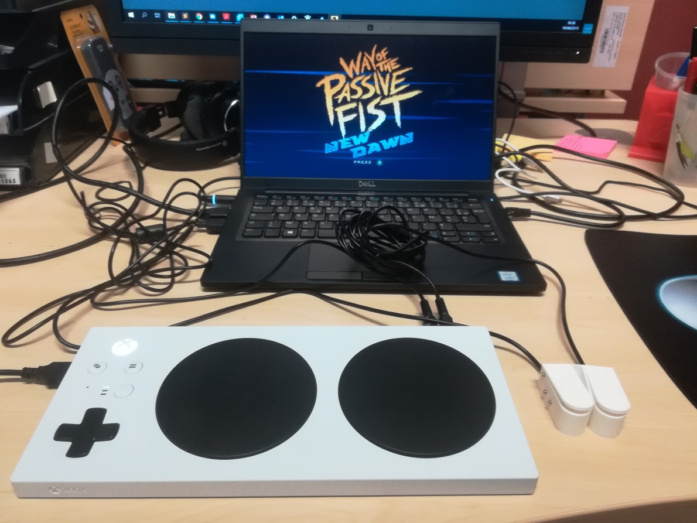
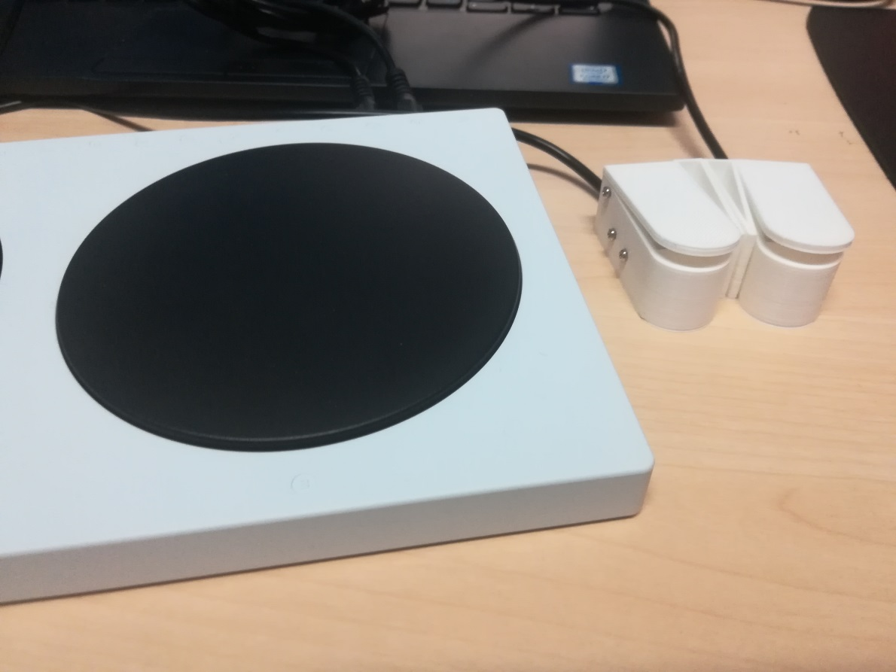
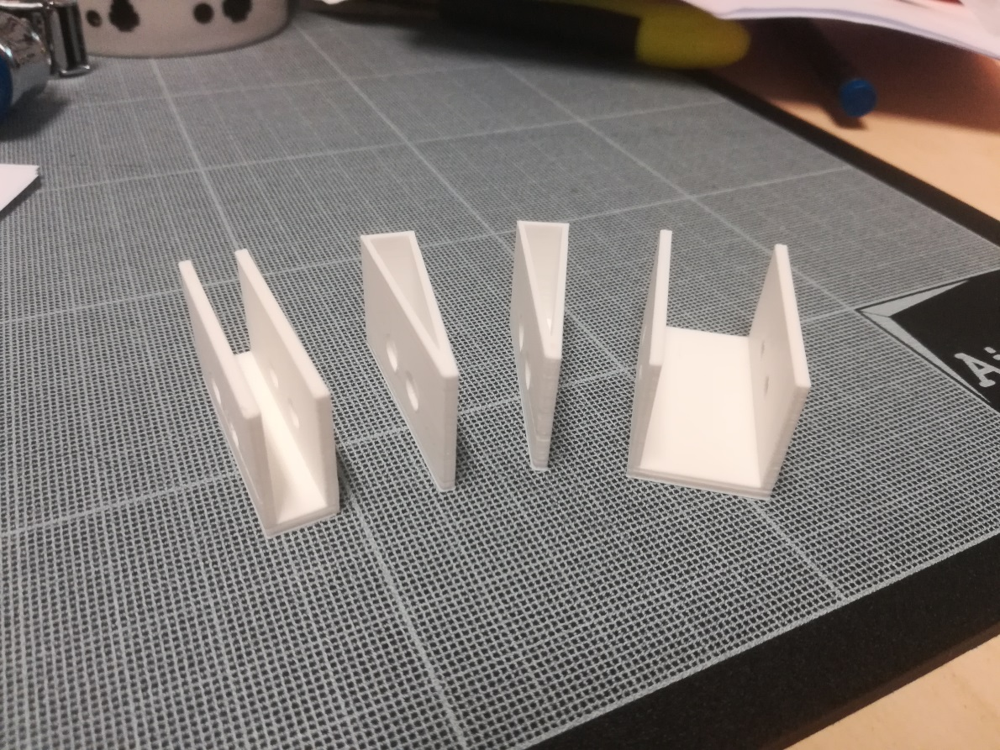
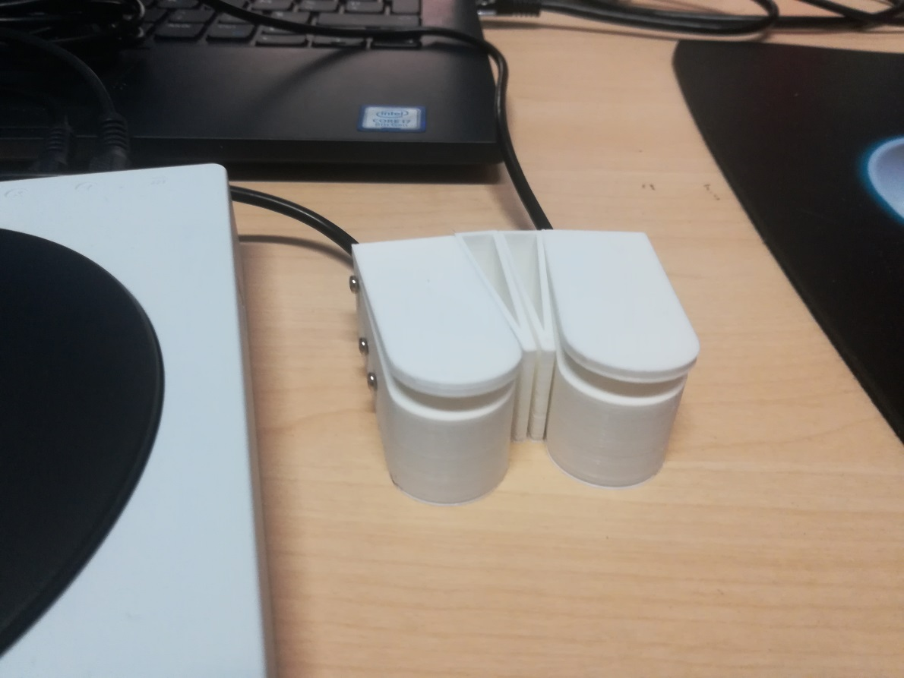

# DIY Low Force Activation Button

 

I will put here all the informations needed to reproduce a low force pressure button, an actuator that can be used with any assitive technology using 3.5 jack input (such as the Xbox Adaptive Controller, wich served here as a starting point). 

## Here is a first Bill of Material:

- 3 x screws with a diameter of 2 mm and a maximum length of 22 mm
- 1 x Panasonic AVT3232613 Microruptor switch or any switch from the AVT3 FS-T series
- 1 x mono (or stereo) jack 3.5 cable

**STL files to print the switch can be found in the 3D models folder**

WIP : More information for printer configuration to come

**You can also found some support part (prototypes) to combine the switch to different configuration. See pictures for exemple :**

 
